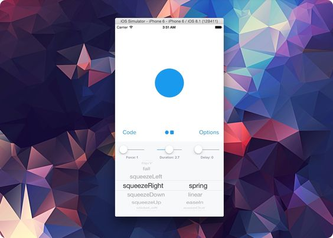

# Spring

 

## Description

🔸 A library to simplify iOS animations in Swift.
 🔸 Refactored `Swift Package Manager` version of the [Spring](https://github.com/MengTo/Spring).

## Installation

Use `Swift Package Manager` to install.

## How To Use It

Read the original [README](https://github.com/MengTo/Spring/blob/d507c1244f944dcf675aa46fe024e2b2f40a662c/README.md) file.

## Credits

Created and maintained by [MengTo](https://github.com/MengTo). Refactored and adapted for use with the `Swift Package Manager` by [epitonium](https://github.com/epitonium).

## License

`Spring` is distributed under the terms and conditions of the [LICENSE](https://github.com/MengTo/Spring/blob/d507c1244f944dcf675aa46fe024e2b2f40a662c/LICENSE).
